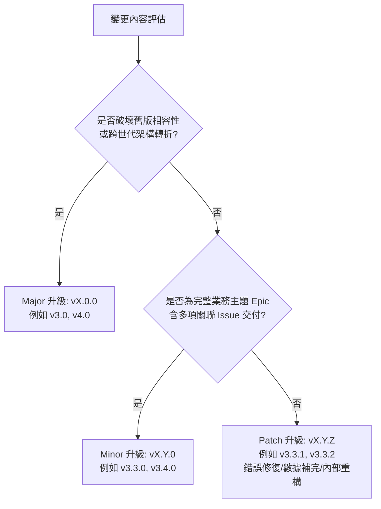
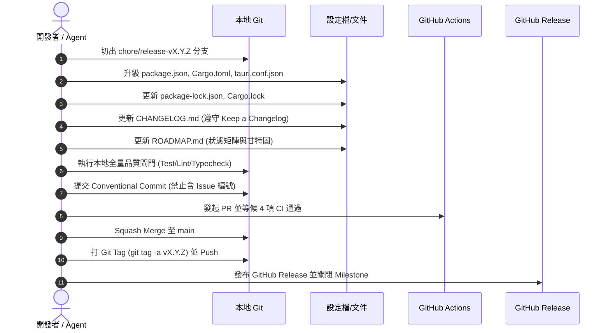

# 📜 POE_tool 版本發布與生命週期管理規範 (Release & Versioning Governance)

本文件定義 **POE_tool** 的語意化版本（Semantic Versioning 2.0.0）原則、版本發布節奏、里程碑建立門檻與自動化發布查驗流程，旨在杜絕「微版本過度膨脹（Micro-Versioning Fatigue）」，保持代碼庫演進清晰、可預測且符合高規格軟體工程標準。

---

## 1. 🌟 核心原則與語意化版本規範 (SemVer 2.0.0)

版本格式固定為：`vMAJOR.MINOR.PATCH`（例如 `v3.3.0`）。



### 1.1 主版本號 (Major: `vX.0.0`)
- **升級時機**：
  - 專案發生跨世代架構重構或重大技術棧轉折（如 v2.x 升級至 v3.0 次世代雙核心架構）。
  - 對底層 LocalStorage/IndexedDB 儲存結構或核心 API 產生破壞性變更（Breaking Changes），舊資料需全量架構遷移。
  - 重大平台或生態擴展（如未來 v4.0 AI 智慧流派推薦與跨平台生態）。
- **發布週期**：數月至半年以上，需經過完整的架構評審與穩定性測試。

### 1.2 次版本號 (Minor: `vX.Y.0`)
- **升級時機**：
  - 以「**完整業務主題（Feature Epic Pack）**」為單位發布，通常聚合 **3 至 6 個關聯 Issue** 或打通一條完整的端到端（End-to-End）玩家體驗路徑。
  - **🚫 嚴格禁止事項**：**禁止為單一小功能、單一獨立元件或小幅介面修改單獨晉升 Minor 版本**。
  - 範例：
    - `v3.3.0`：次世代核心體驗重整與工程架構地基（整合版本規劃、PoE 1/2 能力矩陣、滾動日誌、文檔規格化與側邊欄首頁重構）。
    - `v3.4.0`：PoE 2 終局輿圖、深淵刷圖與經濟生態（整合銘刻地圖危險評級、塔台群落、日誌金幣結算與符文黑市）。
- **發布週期**：以 Milestone 為交付單位，週期約 1 至 3 週。

### 1.3 修訂修復版本號 (Patch: `vX.Y.Z`)
- **升級時機**：
  - **Bug Fixes**：修復已知錯誤、官方 API 回應格式變更相容、邊界條件崩潰。
  - **Hotfix**：緊急阻斷性問題修復。
  - **Data Updates**：繁中/英文詞綴字典增補、物品基底別名修正、匯率計算微調。
  - **Internal Refactoring**：不改變既有對外契約的底層效能優化、單元測試重構、行數收斂。
- **發布方式**：由 `main` 或 `hotfix/` 分支直接打 Patch Tag 發布。

---

## 2. 🏛️ GitHub Milestone 治理與建立門檻

為避免 Milestone 列表破碎雜亂，所有 Milestone 均需嚴格遵守以下治理規範：

1. **一對一 Epic 對齊**：
   - 每個 GitHub Milestone 必須對應 `ROADMAP.md` 中的一個明確階段主題（Epic），並設定明確的目標版本（如 `v3.3.0`）。
2. **Issue 聚合門檻**：
   - 一個 Milestone 至少應包含 3 個以上的具體 Issue（包含前端 UI、領域核心計算、資料適配或工程地基）。
   - 禁止為單獨 1 個 Issue 建立 Milestone。
3. **生命週期狀態**：
   - `🎯 進行中 (Active)`：當前團隊全力衝刺的單一 Milestone。
   - `🔭 規劃中 (Planned)`：下一個接續的 Milestone（預先梳理 Issue 與架構）。
   - `✅ 已發布 (Closed)`：全量 Issue 合併、Release 發布完成後立即 Closed。

---

## 3. 🚀 標準版本發布作業程序 (Release SOP Checklist)

當一個 Milestone 內的所有 Issue 均已通過 PR Squash-Merge 併入 `main` 後，執行以下標準發布流程：



### 發布查驗清單 (Checklist)
- [ ] **版本同步**：
  - `package.json` (`version`)
  - `package-lock.json` (`npm install --package-lock-only`)
  - `src-tauri/Cargo.toml` (`[package] version`)
  - `src-tauri/Cargo.lock` (`cargo check`)
  - `src-tauri/tauri.conf.json` (`version`)
- [ ] **日誌與路線圖**：
  - `CHANGELOG.md`：新增 `## [X.Y.Z] - YYYY-MM-DD` 區塊，底端比對連結正確更新。
  - `src/__tests__/changelogLinks.test.ts`：更新測試案例，確保所有連結 100% 正確匹配。
  - `ROADMAP.md`：將該版本標記為 `✅ 已發布`，甘特圖任務標為 `:done`。
- [ ] **品質閘門**：
  - `npm test`（前端所有測試全數通過）
  - `cargo test --manifest-path src-tauri/Cargo.toml`（Rust 測試全數通過）
  - `npx oxlint .`（0 警告 0 錯誤）
  - `npx tsc -b --noEmit`（型別檢查 0 錯誤）
- [ ] **Release 結案**：
  - 建立 Git Annotated Tag：`git tag -a vX.Y.Z -m "Release vX.Y.Z - 主題名稱"`
  - `git push origin vX.Y.Z`
  - GitHub Release 正式發布，包含重點摘要與 Full Changelog 比對連結。
  - 關閉對應的 GitHub Milestone。

---

## 4. 📝 CHANGELOG 與 Release Notes 格式標準

嚴格遵循 [Keep a Changelog 1.1.0](https://keepachangelog.com/zh-TW/1.1.0/)：

```markdown
## [3.3.0] - 2026-09-06

### ✨ 新增 (Added)
- 新增模組或使用者可見的功能。

### 🔄 變更 (Changed)
- 既有功能的行為調整或介面重構。

### ♻️ 重構 (Refactored)
- 內部程式碼結構優化、架構解耦，無外部行為改變。

### 🐛 修復 (Fixed)
- 錯誤修復與邊界例外處理。

### 🔒 安全性 (Security)
- 敏感資料遮蔽或相依套件漏洞修補。
```
