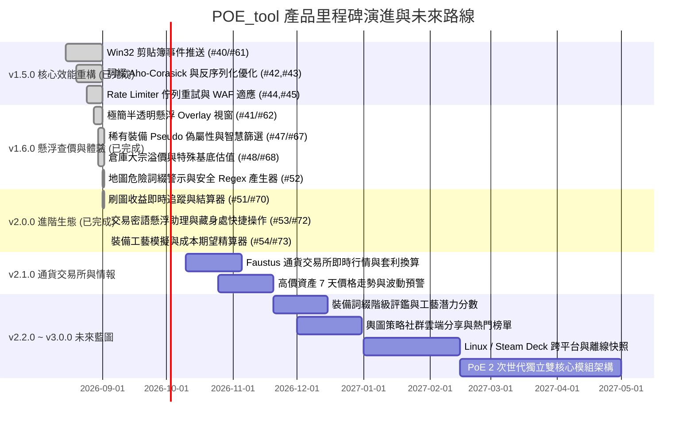

# 🗺️ POE_tool 產品里程碑與發展路線圖 (Roadmap & Milestones)

歡迎查閱 **POE_tool** 的產品發展路線圖。本文件記載了專案從底層效能重構、極簡遊戲懸浮窗、智慧查價、進階刷圖結算，到交易密語助理、工藝期望精算與未來次世代架構的完整版本演進藍圖。

---

## 📑 目錄

1. [🌟 核心設計哲學與架構原則](#1--核心設計哲學與架構原則)
2. [📌 里程碑總覽 (Milestones Overview)](#2--里程碑總覽-milestones-overview)
3. [📊 歷程與當前版本達成狀態 (Progress & Completion Matrix)](#3--歷程與當前版本達成狀態-progress--completion-matrix)
4. [🚀 後續更新版本詳細規劃 (Detailed Future Roadmap)](#4--後續更新版本詳細規劃-detailed-future-roadmap)
   - [階段一 (v2.0.0)：進階刷圖結算、交易密語助理與工藝模擬 (Advanced Automation & Trading Ecosystem)](#階段一-v200進階刷圖結算交易密語助理與工藝模擬-advanced-automation--trading-ecosystem)
   - [階段二 (v2.1.0)：官方通貨交易所與即時市場情報 (Currency Exchange & Market Intelligence)](#階段二-v210官方通貨交易所與即時市場情報-currency-exchange--market-intelligence)
   - [階段三 (v2.2.0)：進階裝備評鑑與輿圖社群生態 (Gear Inspector & Atlas Community Hub)](#階段三-v220進階裝備評鑑與輿圖社群生態-gear-inspector--atlas-community-hub)
   - [階段四 (v2.3.0)：系統底層極致化與跨平台架構 (Deep Performance & Cross-Platform)](#階段四-v230系統底層極致化與跨平台架構-deep-performance--cross-platform)
   - [階段五 (v3.0.0+)：次世代雙核心架構 (PoE 2 Next-Gen Architecture Vision)](#階段五-v300次世代雙核心架構-poe-2-next-gen-architecture-vision)
5. [🤝 參與貢獻與協作規範](#5--參與貢獻與協作規範)

---

## 1. 🌟 核心設計哲學與架構原則

POE_tool 致力於成為《流亡黯道 (Path of Exile)》台服與國際服玩家最信賴、極致輕量且反應最迅捷的本機輔助工具。我們的架構原則包括：

- ⚡ **原生極速、零肥大依賴**：基於 Tauri 2.0 + Rust 微核心，記憶體維持在 30~60MB 區間，摒棄肥重的 Electron 或 Node.js 執行期。
- 🔒 **100% 本地安全與隱私第一**：無遠端數據收集伺服器，憑證與 Session 僅於本機與官方 API 溝通，保障玩家帳號安全。
- 🇹🇼 **深耕繁體中文與台服市集**：內建 17,600+ 繁中詞綴對照與雙向智慧字典，弭平語言隔閡。
- 🏛️ **六角架構與高標準工程品質**：模組化解耦（檔案 $\le 200$ 行、函式 $\le 30$ 行）、嚴格型別、全自動化測試保護（330+ 前端測試與 50+ Rust 測試）與 GitHub 標準協作流程。

---

## 2. 📌 里程碑總覽 (Milestones Overview)

| 版本里程碑 | 核心主題 | 目標狀態 | 關聯 GitHub Milestone / 目標 |
| :--- | :--- | :---: | :--- |
| 🟢 **v1.5.0** | **穩定性與效能重構** *(Stability & Core Optimization)* | ✅ 已發布 | [Milestone v1.5.0](https://github.com/saijo0404/POE-tool/milestone/1) |
| 🟢 **v1.6.0** | **查價與使用者體驗躍升** *(UX & In-Game Overlay)* | ✅ 已整合 | [Milestone v1.6.0](https://github.com/saijo0404/POE-tool/milestone/2) |
| 🟢 **v2.0.0** | **高階自動化、交易助理與工藝精算** *(Advanced Automation & Crafting)* | ✅ 已發布 | [Milestone v2.0.0](https://github.com/saijo0404/POE-tool/milestone/3) |
| 📋 **v2.1.0** | **官方通貨交易所與即時市場情報** *(Exchange & Market Intel)* | 📋 規劃中 | 追蹤 Faustus 黑市交易所、即時套利與高階物價走勢 |
| 📋 **v2.2.0** | **進階裝備評鑑與輿圖社群生態** *(Gear Inspector & Atlas Hub)* | 📋 規劃中 | 裝備 T1~T12 階級評鑑、工藝潛力分、社群輿圖分享 |
| 🔭 **v2.3.0** | **跨平台支援與離線資料庫快照** *(Linux/Proton & Offline DB)* | 🔭 規劃中 | Steam Deck / Linux 支援、SQLite 本機物價向量快取 |
| 🔮 **v3.0.0+** | **PoE 2 次世代雙核心獨立架構** *(PoE 2 Dual Engine Vision)* | 🔭 願景藍圖 | PoE 1 / PoE 2 雙引擎無縫切換、專屬全新機制適配 |

---

## 3. 📊 歷程與當前版本達成狀態 (Progress & Completion Matrix)

---

## 4. 🚀 後續更新版本詳細規劃 (Detailed Future Roadmap)

### 階段一 (v2.0.0)：進階刷圖結算、交易密語助理與工藝模擬 (Advanced Automation & Trading Ecosystem)

> **核心目標**：完整打通玩家日常「刷圖結算 ➔ 買賣交易 ➔ 裝備製造」三大高頻使用場景，成為最全能的遊戲助手。

#### 📦 交付功能與關鍵項目

1. **📊 刷圖收益即時追蹤與結算器 (Mapping Session & Profit Tracker)** `[已交付/待整合發布]`
   - 透過 `Client.txt` 日誌自動偵測進出地圖事件與歷程計時。
   - 進出圖前後自動計算背包與倉庫物品資產差額，即時精算單場利潤、總累計收益與神聖石時薪（Divine/hr）。
   - 支援警示音效、自訂投資成本扣除與 Markdown/CSV 收益報表匯出。
   - 關聯 PR/Issue：[#51](https://github.com/saijo0404/POE-tool/issues/51), [#70](https://github.com/saijo0404/POE-tool/pull/70)
2. **💬 交易密語懸浮助理與藏身處快速操作 (Trade Whisper & Quick Response Assistant)** `[已交付/待整合發布]`
   - 即時監聽 `Client.txt` 交易密語（`@From <玩家名>: Hi, I would like to buy your...`）。
   - 畫面邊緣自動彈出迷你快捷卡片：
     - 🟢 **組隊 (`/invite`)**：一鍵邀請買家。
     - 🔵 **稍候 (`@<玩家名>`)**：自動回覆「正在刷圖中，請稍候 1 分鐘！」。
     - 🟡 **交易 (`/tradewith`)**：到達藏身處後一鍵發起交易。
     - ⚪ **致謝並踢除 (`ty gl` + `/kick`)**：交易完成一鍵致謝並移出隊伍。
     - 🔴 **回藏身處 (`/hideout`)**：快捷回城。
   - **倉庫格位懸浮高亮標記 (Stash Grid Indicator)**：依據密語中的分頁名稱與座標（例如 `(left 4, top 8)`），於遊戲螢幕以透明方框標示物品確切位置。
   - 關聯 PR/Issue：[#53](https://github.com/saijo0404/POE-tool/issues/53), [#72](https://github.com/saijo0404/POE-tool/pull/72)
3. **🛠️ 裝備工藝模擬與成本期望精算器 (Crafting Calculator)** `[已交付/待整合發布]`
   - 輕量整合 Craft of Exile 之工藝期望模型，收錄精髓 (Essence)、化石 (Fossil)、收割 (Harvest) 與混沌石點骰。
   - 玩家指定裝備基底與目標詞綴組合（前綴/後綴）後，即時計算達成機率、平均耗費通貨期望值與 95% 信心區間成本估算。
   - 自動推薦最省錢的工藝路徑步驟，並提供實機模擬試骰沙盒與 6 大熱門配方一鍵帶入。
   - 關聯 PR/Issue：[#54](https://github.com/saijo0404/POE-tool/issues/54), [#73](https://github.com/saijo0404/POE-tool/pull/73)

---

### 階段二 (v2.1.0)：官方通貨交易所與即時市場情報 (Currency Exchange & Market Intelligence)

> **核心目標**：對接 PoE 3.25+ 引入之官方黑市大宗通貨交易所（Faustus Currency Exchange），提供即時行情與智慧資產趨勢分析。

#### 📦 交付功能與關鍵項目

1. **🪙 Faustus 官方大宗通貨交易所即時行情 (Currency Exchange Tracker)**
   - 支援官方 Currency Exchange 買賣訂單簿即時抓取與比價。
   - 自動試算金幣 (Gold) 手續費與跨幣種即時折算（Chaos ➔ Divine ➔ Mirror）。
   - 提供通貨跨市場價差套利分析（市集直購 vs 交易所掛單價差）。
2. **📈 高價值資產價格趨勢圖與波動預警 (Price Trend & Fluctuation Alert)**
   - 針對獵首 (Headhunter)、魔血 (Mageblood)、卡蘭德之鏡 (Mirror)、鎖鏈等高價傳奇與通貨，提供 7 天歷史走勢圖。
   - 支援自訂價格門檻推播通知（例如：當神聖石單價突破 220C 時發出警報）。
3. **💼 玩家資產組合分析報表 (Asset Portfolio & Net Worth Growth)**
   - 繪製倉庫總淨值隨賽季時間增長曲線圖。
   - 依通貨、命運卡、地圖、甲蟲、精髓分類呈現資產圓餅圖與資產結構分析。

---

### 階段三 (v2.2.0)：進階裝備評鑑與輿圖社群生態 (Gear Inspector & Atlas Community Hub)

> **核心目標**：深度增強玩家對裝備價值的判讀能力，並打造社群共享的輿圖策略生態圈。

#### 📦 交付功能與關鍵項目

1. **🔍 裝備詞綴階級與工藝潛力評鑑 (Item Tier & Crafting Potential Inspector)**
   - 懸浮查價視窗直接標註裝備上每條詞綴之官方 Tier 階級（T1~T12、固定詞綴、隱匿詞綴）。
   - 智慧計算裝備剩餘工藝空間（前綴空幾條、後綴空幾條）與工藝台可補足之最強屬性。
   - 提供「裝備總評分 (Item Potential Score)」，快速識別高價值黃裝底子。
2. **🌐 輿圖策略社群雲端分享中心 (Atlas Strategy Community Hub)**
   - 支援輿圖天賦配置 + 甲蟲備料 + 地圖工藝一鍵產生分享短代碼（Share Code / Base64）。
   - 內建社群精選策略庫（軍團飆車流、甲蟲狂歡流、炸墳收益流、深淵經驗流）。
   - 支援一鍵匯入社群策略並自動生成市集採購清單。
3. **🧭 拓荒流程升級指引浮動窗 (Leveling Progression Floating Guide)**
   - 章節拓荒模式支援「技能與裝備轉換檢查點 (Gem Swap Checkpoint)」。
   - 當角色達到特定等級（例如 Lv 12、Lv 28、Lv 38）時主動提醒更換核心技能寶石與輔助串法。

---

### 階段四 (v2.3.0)：系統底層極致化與跨平台架構 (Deep Performance & Cross-Platform)

> **核心目標**：拓展至 Linux / Steam Deck 玩家群體，並提供斷網環境下的離線快照能力。

#### 📦 交付功能與關鍵項目

1. **🐧 Linux / Steam Deck (Proton) 跨平台適配**
   - 透過 X11 / Wayland 原生模組適配全域快捷鍵與剪貼簿事件監聽。
   - 針對 Steam Deck 7 吋螢幕優化專用高對比觸控操作介面。
2. **📦 離線資料庫快照與本機向量搜尋 (Offline Price Snapshot & DuckDB/SQLite)**
   - 引入本機嵌入式輕量資料庫快取當季歷史物價。
   - 在網路中斷或官方 API 遭 Cloudflare 嚴格限流時，無縫切換至離線估值模式。
   - 實作增量差分更新協定，每次物價同步僅需傳輸幾十 KB 差量資料。

---

### 階段五 (v3.0.0+)：次世代雙核心架構 (PoE 2 Next-Gen Architecture Vision)

> **核心目標**：在《Path of Exile 2》正式發布且 API 穩定後，提供 PoE 1 與 PoE 2 雙引擎無縫切換體驗。

#### 📦 交付功能與關鍵項目

1. **🎮 PoE 1 / PoE 2 雙引擎獨立切換架構**
   - 根據當前執行的遊戲視窗自動識別並切換資料庫與解析器。
2. **🔮 PoE 2 專屬機制深度適配**
   - 適配全新精魂 (Spirit) 系統、雙武器天賦切換 (Dual Weapon Tree)、全新無打孔裝備寶石機制。
   - 對接 PoE 2 官方市集交易格式與全新通貨經濟模型（金幣交易）。

---

## 5. 🤝 參與貢獻與協作規範

POE_tool 是完全由社群驅動的開源專案，我們非常歡迎各方開發者與流亡者共同參與：

- 🐛 **回報錯誤或提出功能建議**：歡迎前往 [GitHub Issues](https://github.com/saijo0404/POE-tool/issues) 建立新 Issue。
- 💻 **參與代碼貢獻**：請參閱 [.antigravity/git-issue-workflow.md](.antigravity/git-issue-workflow.md) 與 [.antigravity/refactor-rules.md](.antigravity/refactor-rules.md) 了解六角架構、單檔 $\le 200$ 行規範與測試要求。
- 💬 **討論與交流**：歡迎在 GitHub Discussions 分享您的輿圖策略、自訂過濾器與使用反饋。

---

*最後更新日期：2026 年 9 月*
