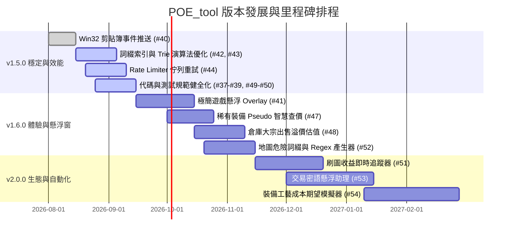

# 🗺️ POE_tool 產品里程碑與發展路線圖 (Roadmap & Milestones)

歡迎查閱 **POE_tool** 的產品發展路線圖。本文件記載了專案從底層效能重構、極簡遊戲懸浮窗、智慧查價，到進階刷圖結算與工藝精算等完整版本演進藍圖。

---

## 📑 目錄

1. [🌟 核心設計哲學與願景](#1--核心設計哲學與願景)
2. [📌 里程碑總覽 (Milestones Overview)](#2--里程碑總覽-milestones-overview)
3. [🚀 各階段詳細規劃與交付目標](#3--各階段詳細規劃與交付目標)
   - [階段一 (v1.5.0)：穩定性與效能重構 (Stability & Core Optimization)](#階段一-v150穩定性與效能重構-stability--core-optimization)
   - [階段二 (v1.6.0)：查價與使用者體驗躍升 (UX & In-Game Overlay)](#階段二-v160查價與使用者體驗躍升-ux--in-game-overlay)
   - [階段三 (v2.0.0)：進階刷圖、交易與工藝生態 (Advanced Automation & Ecosystem)](#階段三-v200進階刷圖交易與工藝生態-advanced-automation--ecosystem)
4. [🔮 未來探索性願景 (Long-term Vision)](#4--未來探索性願景-long-term-vision)
5. [🤝 參與貢獻與需求反饋](#5--參與貢獻與需求反饋)

---

## 1. 🌟 核心設計哲學與願景

POE_tool 致力於成為《流亡黯道 (Path of Exile)》台服與國際服玩家最信賴、極致輕量且反應最迅捷的本機輔助工具。我們的架構原則包括：

- ⚡ **原生極速、零執行期依賴**：基於 Tauri 2.0 + Rust 微核心，記憶體維持在 30~60MB 區間，摒棄肥重的 Electron 或 Node.js 執行期。
- 🔒 **100% 本地安全與隱私第一**：無遠端數據收集伺服器，憑證僅用於官方 API，保障玩家帳號安全。
- 🇹🇼 **深耕繁體中文與台服市集**：內建 17,600+ 繁中詞綴對照與雙向智慧字典，弭平語言隔閡。
- 🏛️ **六角架構與高標準工程品質**：模組化解耦（檔案 $\le 200$ 行、函式 $\le 30$ 行）、嚴格型別、全面自動化測試與 GitHub 標準協作流程。

---

## 2. 📌 里程碑總覽 (Milestones Overview)

| 版本里程碑 | 核心主題 | 目標狀態 | 關聯 GitHub Milestone |
| :--- | :--- | :---: | :--- |
| 🟢 **v1.5.0** | **穩定性與效能重構** *(Stability & Core Optimization)* | 🚀 進行中 | [GitHub Milestone v1.5.0](https://github.com/saijo0404/POE-tool/milestone/1) |
| 🟡 **v1.6.0** | **查價與使用者體驗躍升** *(UX & In-Game Overlay)* | 📋 規劃中 | [GitHub Milestone v1.6.0](https://github.com/saijo0404/POE-tool/milestone/2) |
| 🟣 **v2.0.0** | **進階刷圖、交易與工藝生態** *(Advanced Automation & Ecosystem)* | 🔭 願景藍圖 | [GitHub Milestone v2.0.0](https://github.com/saijo0404/POE-tool/milestone/3) |

---

## 3. 🚀 各階段詳細規劃與交付目標

---

### 階段一 (v1.5.0)：穩定性與效能重構 (Stability & Core Optimization)

> **核心目標**：全面夯實基礎架構，以事件驅動取代傳統輪詢，大幅度壓低冷啟動與詞綴比對延遲，建立完善的 Rate Limiter 彈性佇列與專案工程規範。

#### 📦 交付功能與關鍵項目

- **⚡ 事件驅動剪貼簿推送機制 (Win32 Push vs Poll)**
  - 使用 Win32 `AddClipboardFormatListener` 取代前端 `setInterval` 輪詢，背景待機 CPU 佔用降至 0%。
  - 關聯 Issue：[#40 - [Perf/Windows] 使用 Win32 AddClipboardFormatListener 事件推送取代前端定時輪詢](https://github.com/saijo0404/POE-tool/issues/40)
- **⚡ 靜態詞綴字典載入效能優化**
  - 針對 3.2MB+ 字典 JSON 實作二進制預先序列化與記憶體快取，將冷啟動反序列化時間由 250ms 縮減至 < 20ms。
  - 關聯 Issue：[#42 - [Perf] 優化 3.2MB 靜態詞綴字典啟動載入與反序列化開銷](https://github.com/saijo0404/POE-tool/issues/42)
- **⚡ 未匹配詞綴子字串演算法升級 (Trie / Aho-Corasick)**
  - 將 $O(N)$ 線性搜尋改建為 Trie 前綴樹或 Aho-Corasick 多模式匹配機，未命中比對延遲壓至 < 0.5ms。
  - 關聯 Issue：[#43 - [Perf] 最佳化未匹配詞綴子字串搜尋演算法](https://github.com/saijo0404/POE-tool/issues/43)
- **🛡️ 官方 API 智慧 Rate Limiter 非同步佇列與自動平滑重試**
  - 於 Rust 端透過 Tokio 實作排隊佇列（Queueing Pipeline），遇到 GGG 429 速率限制時自動指數退避並依序重送，不再引發查價中斷。
  - 關聯 Issue：[#44 - [Refactor/Network] 實作 Rate Limiter 非同步請求排隊佇列與自動平滑重試機制](https://github.com/saijo0404/POE-tool/issues/44)
- **🛡️ Cloudflare WAF / Turnstile 驗證適應性與 Session 存活偵測**
  - 完善 Webview 輔助驗證流程，加入心跳偵測與過期提醒，改善官方 Cloudflare 防護阻擋問題。
  - 關聯 Issue：[#45 - [Network/Security] 強化 Cloudflare WAF / Turnstile 驗證適應性與 Session 存活偵測](https://github.com/saijo0404/POE-tool/issues/45)
- **🧹 代碼庫專注度提升與精簡**
  - 移除目前未成熟的 PoE 2 關聯代碼，專注維護 PoE 1 當季版本的絕對穩定。
  - 關聯 Issue：[#46 - [Refactor/Clean] 移除目前未成熟的 PoE 2 關聯代碼，專注維護 PoE 1 穩定性](https://github.com/saijo0404/POE-tool/issues/46)
- **🎨 代碼風格、規範警告與測試健全化**
  - 修復 React Fast Refresh 分離導出規範警告。
  - 修復 Vitest 單元測試非同步狀態更新 `act(...)` 警告。
  - 關聯 Issues：
    - [#49 - [Refactor/Lint] 修復 React Fast Refresh 規範警告](https://github.com/saijo0404/POE-tool/issues/49)
    - [#50 - [Test] 修復 Vitest 單元測試中的 act(...) 非同步狀態更新警告](https://github.com/saijo0404/POE-tool/issues/50)
- **📖 專案工程與文檔健全化**
  - 建立根目錄 `ROADMAP.md`、`CHANGELOG.md` 並校正 `README.md` 執行檔命名。
  - 關聯 Issues：
    - [#37 - [Docs/CI] 建立 ROADMAP.md 並配置 GitHub Milestone](https://github.com/saijo0404/POE-tool/issues/37)
    - [#38 - [Docs] 建立根目錄 CHANGELOG.md 追蹤版本歷史與發布記錄](https://github.com/saijo0404/POE-tool/issues/38)
    - [#39 - [Docs] 修正 README.md 中的執行檔命名與建置說明不一致](https://github.com/saijo0404/POE-tool/issues/39)

---

### 階段二 (v1.6.0)：查價與使用者體驗躍升 (UX & In-Game Overlay)

> **核心目標**：無縫融入遊戲操作流程，推出比擬 Awakened PoE Trade 的極簡遊戲內懸浮透明窗、稀有裝備 Pseudo 智慧統計與大宗物資溢價估值。

#### 📦 交付功能與關鍵項目

- **🪟 極簡遊戲內半透明懸浮查價視窗 (Awakened-style Floating Overlay)**
  - 支援無邊框置頂、全螢幕遊戲視窗點擊穿透 (Click-through)、滑鼠懸停啟用、按鍵即時呼叫與關閉。
  - 支援根據滑鼠游標位置自動對齊彈出，不遮蔽物品屬性欄。
  - 關聯 Issue：[#41 - [Feat/UI] 實作遊戲內極簡半透明懸浮查價視窗](https://github.com/saijo0404/POE-tool/issues/41)
- **🔍 稀有裝備 (Rare Items) Pseudo 偽屬性智慧查價**
  - 智慧聚合「總元素抗性 (Pseudo Total Elemental Resistance)」、「總生命/魔力」、「DPS」等核心複合數值。
  - 智慧挑選並預設勾選裝備上最具市場價值的核心 2~3 條關鍵詞綴，大幅簡化手動設定負擔。
  - 關聯 Issue：[#47 - [Feat/Trade] 提升稀有裝備 (Rare Items) 查價精準度：支援 Pseudo 偽屬性合併與預設關鍵詞綴篩選](https://github.com/saijo0404/POE-tool/issues/47)
- **💰 倉庫大宗出售 (Bulk Sale) 溢價估值模型**
  - 支援設定各類物資（甲蟲、精髓、命運卡、通貨）之大宗出售打包溢價倍率 (Bulk Premium Ratio)。
  - 支援特殊高價值未鑑定基底物與勢力基底定價。
  - 關聯 Issue：[#48 - [Feat/Wealth] 倉庫資產估值支援大宗出售 (Bulk Sale) 溢價係數與特殊基底物定價](https://github.com/saijo0404/POE-tool/issues/48)
- **⚠️ 地圖危險詞綴警示與市集/倉庫 Regex 產生器**
  - 依據玩家所選流派特性（例如：物理/元素反傷、無法回復生命/魔力、降低最大抗性、無法偷取等），自動將危險詞綴標記為紅色高警示。
  - 提供地圖篩選正則表達式（Regex）快速產生與一鍵複製，支援在遊戲倉庫中快速高亮安全地圖。
  - 關聯 Issue：[#52 - [Feat] 實作地圖危險詞綴警示與倉庫/市集 Regex 產生器](https://github.com/saijo0404/POE-tool/issues/52)

---

### 階段三 (v2.0.0)：進階刷圖、交易與工藝生態 (Advanced Automation & Ecosystem)

> **核心目標**：構建全方位的流亡黯道高階輔助生態，涵蓋自動化刷圖打寶統計、交易懸浮助理與裝備工藝成本期望模擬。

#### 📦 交付功能與關鍵項目

- **📊 刷圖收益即時追蹤與結算器 (Mapping Session & Profit Tracker)**
  - 透過 Win32 / 日誌監聽 `Client.txt` 判定進出傳送門與地圖事件。
  - 自動於進圖前與出圖後進行背包/倉庫差異比對，精確結算單場地圖掉落收益、投資成本、淨利潤與每小時神聖石產出率（Divine/hr）。
  - 關聯 Issue：[#51 - [Feat] 實作刷圖收益即時追蹤與結算器](https://github.com/saijo0404/POE-tool/issues/51)
- **💬 交易密語懸浮助理與藏身處快速操作 (Trade Whisper & Response Assistant)**
  - 即時解析遊戲內買賣密語，以懸浮迷你卡片呈現買家名稱、物品名稱、金額與所在倉庫頁位置。
  - 提供一鍵按鈕快捷操作：快速邀請組隊 (`/invite`)、藏身處交易通知、發送交易請求 (`/tradewith`) 與感謝密語 (`/kick` + `ty vm`)。
  - 關聯 Issue：[#53 - [Feat] 實作交易密語懸浮助理與藏身處快速操作](https://github.com/saijo0404/POE-tool/issues/53)
- **🛠️ 裝備工藝模擬與成本期望精算器 (Crafting Calculator)**
  - 輕量整合類似 Craft of Exile 之工藝期望模型，涵蓋精髓（Essence）、化石（Fossil）、收割（Harvest）、破裂（Fracture）與隱匿工藝。
  - 提供指定目標詞綴組合之達成機率、平均耗費通貨期望值與信心區間（P50 / P90 成本估算）。
  - 關聯 Issue：[#54 - [Feat] 實作裝備工藝模擬與成本期望精算器](https://github.com/saijo0404/POE-tool/issues/54)

---

## 4. 🔮 未來探索性願景 (Long-term Vision)

除了上述三個主要版本里程碑外，團隊持續評估並探索以下前瞻性技術與功能：

- 🍏 **跨平台支援 (macOS & Linux)**：評估在 Linux (Proton/Wine) 與 macOS 環境下之快捷鍵與剪貼簿適配層。
- 📦 **離線物價快照與本機向量搜尋**：在無網路或官方 API 波動時，支援使用本機快取物價提供離線估值。
- 🧩 **社群模組與自訂天賦策略市場**：允許玩家匯出與匯入自訂輿圖策略包、自訂過濾器規則與社群熱門配置。
- 🎮 **PoE 2 獨立適配模組**：待《Path of Exile 2》正式上線且 API 規範穩定後，開闢專屬 PoE 2 模組分支。

---

## 5. 🤝 參與貢獻與需求反饋

POE_tool 是熱愛社群的開源專案，我們非常歡迎各方開發者與流亡者共同參與：

- 🐛 **回報錯誤或提出功能建議**：歡迎前往 [GitHub Issues](https://github.com/saijo0404/POE-tool/issues) 建立新 Issue。
- 💻 **參與代碼貢獻**：請參閱 [.antigravity/git-issue-workflow.md](.antigravity/git-issue-workflow.md) 與 [.antigravity/refactor-rules.md](.antigravity/refactor-rules.md) 了解協作與架構規範。
- 💬 **討論與交流**：歡迎在 GitHub Discussions 分享您的輿圖策略與使用反饋。

---

*最後更新日期：2026 年 8 月*
