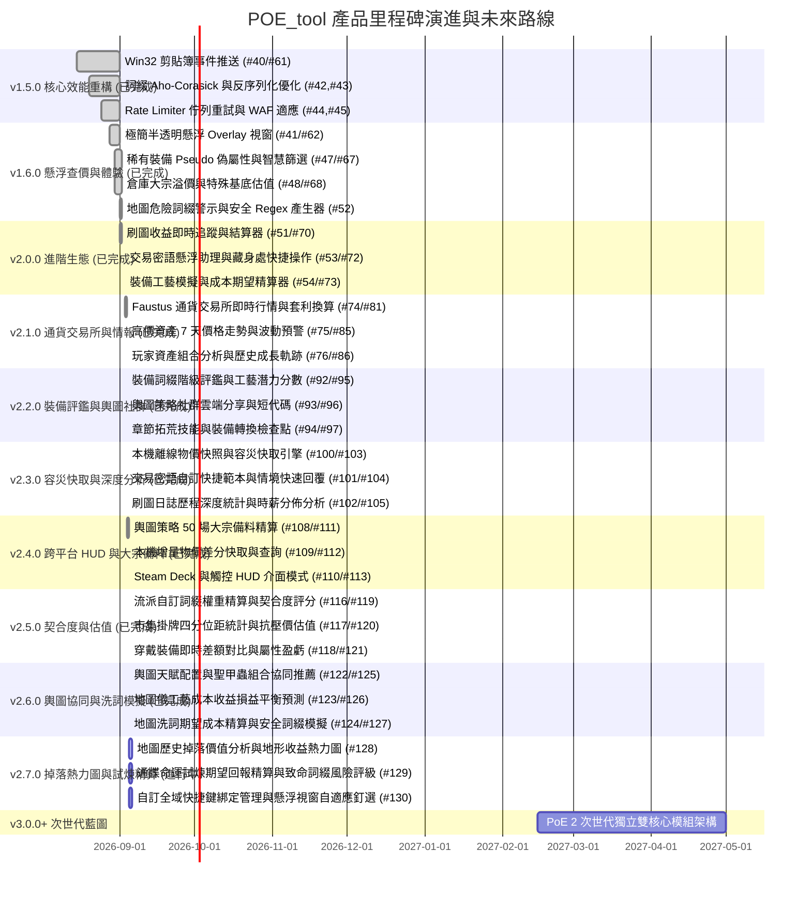

# 🗺️ POE_tool 產品里程碑與發展路線圖 (Roadmap & Milestones)

歡迎查閱 **POE_tool** 的產品發展路線圖。本文件記載了專案從底層效能重構、極簡遊戲懸浮窗、智慧查價、進階刷圖結算，到交易密語助理、工藝期望精算與未來次世代架構的完整版本演進藍圖。

---

## 📑 目錄

1. [🌟 核心設計哲學與架構原則](#1--核心設計哲學與架構原則)
2. [📌 里程碑總覽 (Milestones Overview)](#2--里程碑總覽-milestones-overview)
3. [📊 歷程與當前版本達成狀態 (Progress & Completion Matrix)](#3--歷程與當前版本達成狀態-progress--completion-matrix)
4. [🚀 後續更新版本詳細規劃 (Detailed Future Roadmap)](#4--後續更新版本詳細規劃-detailed-future-roadmap)
   - [階段一 (v2.0.0)：進階刷圖結算、交易密語助理與工藝模擬 (Advanced Automation & Trading Ecosystem)](#階段一-v200進階刷圖結算交易密語助理與工藝模擬-advanced-automation--trading-ecosystem)
   - [階段二 (v2.1.0)：官方通貨交易所與即時市場情報 (Currency Exchange & Market Intelligence)](#階段二-v210官方通貨交易所與即時市場情報-currency-exchange--market-intelligence)
   - [階段三 (v2.2.0)：進階裝備評鑑與輿圖社群生態 (Gear Inspector & Atlas Community Hub)](#階段三-v220進階裝備評鑑與輿圖社群生態-gear-inspector--atlas-community-hub)
   - [階段四 (v2.3.0)：離線容災快取、自訂密語範本與刷圖歷史分析 (Offline Fallback, Whisper Templates & Mapping Analytics)](#階段四-v230離線容災快取自訂密語範本與刷圖歷史分析-offline-fallback-whisper-templates--mapping-analytics)
   - [階段五 (v2.4.0)：跨平台適配、增量物價引擎與輿圖大宗採購精算 (Cross-Platform HUD, Incremental Price Engine & Bulk Shopping)](#階段五-v240跨平台適配增量物價引擎與輿圖大宗採購精算-cross-platform-hud-incremental-price-engine--bulk-shopping)
   - [階段六 (v2.5.0)：流派契合度精算、抗壓價市集估值與穿戴裝備即時差額分析 (Build Fit Scoring, Fair Price Advisor & Gear Comparison)](#階段六-v250流派契合度精算抗壓價市集估值與穿戴裝備即時差額分析-build-fit-scoring-fair-price-advisor--gear-comparison)
   - [階段七 (v2.6.0)：輿圖聖甲蟲組合協同、地圖工藝損益預測與地圖洗詞期望模擬 (Atlas Scarab Synergy, Device Craft Forecaster & Map Rolling Simulator)](#階段七-v260輿圖聖甲蟲組合協同地圖工藝損益預測與地圖洗詞期望模擬-atlas-scarab-synergy-device-craft-forecaster--map-rolling-simulator)
   - [階段八 (v2.7.0)：地圖歷史掉落熱力圖、通牒命運試煉精算與自訂置頂快捷鍵 (Map Drop Heatmap, Ultimatum EV & Custom Hotkey Pinning)](#階段八-v270地圖歷史掉落熱力圖通牒命運試煉精算與自訂置頂快捷鍵-map-drop-heatmap-ultimatum-ev--custom-hotkey-pinning)
   - [階段九 (v2.8.0)：迷霧瞻妄層數期望精算、軍團永恆珠寶種子鑑定與多物品比價暫存列 (Delirium EV Forecaster, Timeless Jewel Evaluator & Comparison Tray)](#階段九-v280迷霧瞻妄層數期望精算軍團永恆珠寶種子鑑定與多物品比價暫存列-delirium-ev-forecaster-timeless-jewel-evaluator--comparison-tray)
   - [階段十 (v3.0.0+)：次世代雙核心架構 (PoE 2 Next-Gen Architecture Vision)](#階段十-v300次世代雙核心架構-poe-2-next-gen-architecture-vision)
5. [🤝 參與貢獻與協作規範](#5--參與貢獻與協作規範)

---

## 1. 🌟 核心設計哲學與架構原則

POE_tool 致力於成為《流亡黯道 (Path of Exile)》台服與國際服玩家最信賴、極致輕量且反應最迅捷的本機輔助工具。我們的架構原則包括：

- ⚡ **原生極速、零肥大依賴**：基於 Tauri 2.0 + Rust 微核心，記憶體維持在 30~60MB 區間，摒棄肥重的 Electron 或 Node.js 執行期。
- 🔒 **100% 本地安全與隱私第一**：無遠端數據收集伺服器，憑證與 Session 僅於本機與官方 API 溝通，保障玩家帳號安全。
- 🇹🇼 **深耕繁體中文與台服市集**：內建 17,600+ 繁中詞綴對照與雙向智慧字典，弭平語言隔閡。
- 🏛️ **六角架構與高標準工程品質**：模組化解耦（檔案 $\le 200$ 行、函式 $\le 30$ 行）、嚴格型別、全自動化測試保護（330+ 前端測試與 50+ Rust 測試）與 GitHub 標準協作流程。

---

## 2. 📌 里程碑總覽 (Milestones Overview)

| 版本里程碑 | 核心主題 | 目標狀態 | 關聯 GitHub Milestone / 目標 |
| :--- | :--- | :---: | :--- |
| 🟢 **v1.5.0** | **穩定性與效能重構** *(Stability & Core Optimization)* | ✅ 已發布 | [Milestone v1.5.0](https://github.com/saijo0404/POE-tool/milestone/1) |
| 🟢 **v1.6.0** | **查價與使用者體驗躍升** *(UX & In-Game Overlay)* | ✅ 已整合 | [Milestone v1.6.0](https://github.com/saijo0404/POE-tool/milestone/2) |
| 🟢 **v2.0.0** | **高階自動化、交易助理與工藝精算** *(Advanced Automation & Crafting)* | ✅ 已發布 | [Milestone v2.0.0](https://github.com/saijo0404/POE-tool/milestone/3) |
| 🟢 **v2.1.0** | **官方通貨交易所與即時市場情報** *(Exchange & Market Intel)* | ✅ 已發布 | [Milestone v2.1.0](https://github.com/saijo0404/POE-tool/milestone/4) |
| 🟢 **v2.2.0** | **進階裝備評鑑與輿圖社群生態** *(Gear Inspector & Atlas Hub)* | ✅ 已發布 | [Milestone v2.2.0](https://github.com/saijo0404/POE-tool/milestone/5) |
| 🟢 **v2.3.0** | **離線容災快取、自訂密語範本與刷圖歷史分析** *(Offline Fallback, Whisper Templates & Mapping Analytics)* | ✅ 已發布 | [Milestone v2.3.0](https://github.com/saijo0404/POE-tool/milestone/6) |
| 🟢 **v2.4.0** | **跨平台適配、增量物價引擎與輿圖大宗採購精算** *(Cross-Platform HUD, Incremental Price Engine & Bulk Shopping)* | ✅ 已發布 | [Milestone v2.4.0](https://github.com/saijo0404/POE-tool/milestone/7) |
| 🟢 **v2.5.0** | **流派契合度精算、抗壓價市集估值與穿戴裝備即時差額分析** *(Build Fit Scoring, Fair Price Advisor & Gear Comparison)* | ✅ 已發布 | [Milestone v2.5.0](https://github.com/saijo0404/POE-tool/milestone/8) |
| 🟢 **v2.6.0** | **輿圖聖甲蟲組合協同、地圖工藝損益預測與地圖洗詞期望模擬** *(Scarab Synergy, Device Craft Forecaster & Map Rolling Simulator)* | ✅ 已發布 | [Milestone v2.6.0](https://github.com/saijo0404/POE-tool/milestone/9) |
| 🟢 **v2.7.0** | **地圖歷史掉落熱力圖、通牒命運試煉精算與自訂置頂快捷鍵** *(Map Drop Heatmap, Ultimatum EV & Custom Hotkey Pinning)* | ✅ 已發布 | [Milestone v2.7.0](https://github.com/saijo0404/POE-tool/milestone/10) |
| 🟢 **v2.8.0** | **迷霧瞻妄層數期望精算、軍團永恆珠寶種子鑑定與多物品比價暫存列** *(Delirium EV Forecaster, Timeless Jewel Evaluator & Comparison Tray)* | ✅ 已發布 | [Milestone v2.8.0](https://github.com/saijo0404/POE-tool/milestone/11) |
| 🔮 **v3.0.0+** | **PoE 2 次世代雙核心獨立架構** *(PoE 2 Dual Engine Vision)* | 🔭 願景藍圖 | PoE 1 / PoE 2 雙引擎無縫切換、專屬全新機制適配 |

---

## 3. 📊 歷程與當前版本達成狀態 (Progress & Completion Matrix)

---

## 4. 🚀 後續更新版本詳細規劃 (Detailed Future Roadmap)

### 階段一 (v2.0.0)：進階刷圖結算、交易密語助理與工藝模擬 (Advanced Automation & Trading Ecosystem)

> **核心目標**：完整打通玩家日常「刷圖結算 ➔ 買賣交易 ➔ 裝備製造」三大高頻使用場景，成為最全能的遊戲助手。

#### 📦 交付功能與關鍵項目

1. **📊 刷圖收益即時追蹤與結算器 (Mapping Session & Profit Tracker)** `[已交付/待整合發布]`
   - 透過 `Client.txt` 日誌自動偵測進出地圖事件與歷程計時。
   - 進出圖前後自動計算背包與倉庫物品資產差額，即時精算單場利潤、總累計收益與神聖石時薪（Divine/hr）。
   - 支援警示音效、自訂投資成本扣除與 Markdown/CSV 收益報表匯出。
   - 關聯 PR/Issue：[#51](https://github.com/saijo0404/POE-tool/issues/51), [#70](https://github.com/saijo0404/POE-tool/pull/70)
2. **💬 交易密語懸浮助理與藏身處快速操作 (Trade Whisper & Quick Response Assistant)** `[已交付/待整合發布]`
   - 即時監聽 `Client.txt` 交易密語（`@From <玩家名>: Hi, I would like to buy your...`）。
   - 畫面邊緣自動彈出迷你快捷卡片：
     - 🟢 **組隊 (`/invite`)**：一鍵邀請買家。
     - 🔵 **稍候 (`@<玩家名>`)**：自動回覆「正在刷圖中，請稍候 1 分鐘！」。
     - 🟡 **交易 (`/tradewith`)**：到達藏身處後一鍵發起交易。
     - ⚪ **致謝並踢除 (`ty gl` + `/kick`)**：交易完成一鍵致謝並移出隊伍。
     - 🔴 **回藏身處 (`/hideout`)**：快捷回城。
   - **倉庫格位懸浮高亮標記 (Stash Grid Indicator)**：依據密語中的分頁名稱與座標（例如 `(left 4, top 8)`），於遊戲螢幕以透明方框標示物品確切位置。
   - 關聯 PR/Issue：[#53](https://github.com/saijo0404/POE-tool/issues/53), [#72](https://github.com/saijo0404/POE-tool/pull/72)
3. **🛠️ 裝備工藝模擬與成本期望精算器 (Crafting Calculator)** `[已交付/待整合發布]`
   - 輕量整合 Craft of Exile 之工藝期望模型，收錄精髓 (Essence)、化石 (Fossil)、收割 (Harvest) 與混沌石點骰。
   - 玩家指定裝備基底與目標詞綴組合（前綴/後綴）後，即時計算達成機率、平均耗費通貨期望值與 95% 信心區間成本估算。
   - 自動推薦最省錢的工藝路徑步驟，並提供實機模擬試骰沙盒與 6 大熱門配方一鍵帶入。
   - 關聯 PR/Issue：[#54](https://github.com/saijo0404/POE-tool/issues/54), [#73](https://github.com/saijo0404/POE-tool/pull/73)

---

### 階段二 (v2.1.0)：官方通貨交易所與即時市場情報 (Currency Exchange & Market Intelligence)

> **核心目標**：對接 PoE 3.25+ 引入之官方黑市大宗通貨交易所（Faustus Currency Exchange），提供即時行情與智慧資產趨勢分析。

#### 📦 交付功能與關鍵項目

1. **🪙 Faustus 官方大宗通貨交易所即時行情 (Currency Exchange Tracker)** `[已交付/已發布]`
   - 支援官方 Currency Exchange 買賣訂單簿即時抓取與比價。
   - 自動試算金幣 (Gold) 手續費與跨幣種即時折算（Chaos ➔ Divine ➔ Mirror）。
   - 提供通貨跨市場價差套利分析（市集直購 vs 交易所掛單價差）。
   - 關聯 PR/Issue：[#74](https://github.com/saijo0404/POE-tool/issues/74), [#81](https://github.com/saijo0404/POE-tool/pull/81)
2. **📈 高價值資產價格趨勢圖與波動預警 (Price Trend & Fluctuation Alert)** `[已交付/已發布]`
   - 針對獵首 (Headhunter)、魔血 (Mageblood)、卡蘭德之鏡 (Mirror)、鎖鏈等高價傳奇與通貨，提供 7 天歷史走勢圖。
   - 支援自訂價格門檻推播通知（例如：當神聖石單價突破 220C 時發出警報）。
   - 關聯 PR/Issue：[#75](https://github.com/saijo0404/POE-tool/issues/75), [#85](https://github.com/saijo0404/POE-tool/pull/85)
3. **💼 玩家資產組合分析報表 (Asset Portfolio & Net Worth Growth)** `[已交付/已發布]`
   - 繪製倉庫總淨值隨賽季時間增長曲線圖。
   - 依通貨、命運卡、地圖、甲蟲、精髓分類呈現資產圓餅圖與資產結構分析。
   - 關聯 PR/Issue：[#76](https://github.com/saijo0404/POE-tool/issues/76), [#86](https://github.com/saijo0404/POE-tool/pull/86)

---

### 階段三 (v2.2.0)：進階裝備評鑑與輿圖社群生態 (Gear Inspector & Atlas Community Hub) `[已發布]`

> **核心目標**：深度增強玩家對裝備價值的判讀能力，並打造社群共享的輿圖策略生態圈。

#### 📦 交付功能與關鍵項目

1. **🔍 裝備詞綴階級與工藝潛力評鑑 (Item Tier & Crafting Potential Inspector)** `[已交付]`
   - 懸浮查價視窗直接標註裝備上每條詞綴之官方 Tier 階級（T1~T12、固定詞綴、隱匿詞綴）。
   - 智慧計算裝備剩餘工藝空間（前綴空幾條、後綴空幾條）與工藝台可補足之最強屬性。
   - 提供「裝備總評分 (Item Potential Score)」，快速識別高價值黃裝底子。
   - 關聯 PR/Issue：[#92](https://github.com/saijo0404/POE-tool/issues/92), [#95](https://github.com/saijo0404/POE-tool/pull/95)
2. **🌐 輿圖策略社群雲端分享中心 (Atlas Strategy Community Hub)** `[已交付]`
   - 支援輿圖天賦配置 + 甲蟲備料 + 地圖工藝一鍵產生分享短代碼（`POEATLAS-v1-` Base64url）。
   - 內建社群精選策略庫（軍團飆車流、甲蟲狂歡流、炸墳收益流、莊園作物輪替、通牒致命試煉）。
   - 支援一鍵匯入社群策略並自動精算 50 場大宗採購清單與成本。
   - 關聯 PR/Issue：[#93](https://github.com/saijo0404/POE-tool/issues/93), [#96](https://github.com/saijo0404/POE-tool/pull/96)
3. **🧭 拓荒流程升級指引浮動窗 (Leveling Progression Floating Guide)** `[已交付]`
   - 章節拓荒模式支援「技能與裝備轉換檢查點 (Gem Swap Checkpoints)」。
   - 當角色達到特定等級（例如 Lv 12、Lv 28、Lv 38）時主動提醒更換核心技能寶石與輔助串法。
   - 智慧對照屬性門檻並發出底座配戴警示（海玉護身符、重革腰帶等）。
   - 關聯 PR/Issue：[#94](https://github.com/saijo0404/POE-tool/issues/94), [#97](https://github.com/saijo0404/POE-tool/pull/97)

---

### 階段四 (v2.3.0)：離線容災快取、自訂密語範本與刷圖歷史分析 (Offline Fallback, Whisper Templates & Mapping Analytics)

> **核心目標**：強化網路限流環境下的容災韌性，支援多元情境交易密語回覆，並提供刷圖歷程多維度深度統計與策略回報分析。

#### 📦 交付功能與關鍵項目

1. **📦 本機離線物價快照與容災快取引擎 (Offline Price Snapshot & Fallback Engine)** `[已交付/已發布]`
   - 純領域快照結構與合法性驗證 (`priceSnapshotEngine.ts`)，支援精確、模糊與類別降級匹配。
   - 提供 24 小時快照陳舊度 (Stale Age) 健康度判定與友好相對時間計算。
   - LocalStorage 持久化快取 (`priceSnapshotStorage.ts`)、JSON 快照手動備份匯出/匯入與查價介面容災徽章 (`PriceSnapshotBadge.tsx`)。
   - 關聯 PR/Issue：[#100](https://github.com/saijo0404/POE-tool/issues/100), [#103](https://github.com/saijo0404/POE-tool/pull/103)
2. **💬 交易密語自訂快捷範本與情境快速回覆 (Customizable Trade Whisper Templates & Quick Actions)** `[已交付/已發布]`
   - 多情境密語範本純領域管理 (`whisperTemplates.ts`)，內建刷圖稍候、打王攻堅、物品已售出、感謝交易等情境。
   - 支援動態變數替換（`{buyer}`, `{item}`, `{price}`, `{stash}`）與合法性校驗。
   - 交易懸浮卡片 (`TradeWhisperCard.tsx`) 整合「⚡ 情境回覆範本」快捷選單，一鍵發送特定情境回覆至遊戲內。
   - 交易設定 (`TradeWhisperTester.tsx`) 提供自訂範本增刪與重設預設值。
   - 關聯 PR/Issue：[#101](https://github.com/saijo0404/POE-tool/issues/101), [#104](https://github.com/saijo0404/POE-tool/pull/104)
3. **📈 刷圖日誌歷程深度統計與時薪分佈分析 (Mapping History Analytics & Hourly Profit Distribution)** `[已交付/已發布]`
   - 多 Session 歷程聚合分析核心 (`mappingAnalytics.ts`)，計算總刷圖場次、累積總時長、總淨利潤、綜合平均時薪、單場均利與最佳回報 Top 3 排行。
   - 支援依聯盟、時間區間（今日、近 7 天、近 30 天、全部）與輿圖策略多維度過濾。
   - 刷圖記錄器 (`MappingTracker.tsx`) 整合深度統計分析卡片 (`MappingHistoryAnalyticsCard.tsx`)。
   - 關聯 PR/Issue：[#102](https://github.com/saijo0404/POE-tool/issues/102), [#105](https://github.com/saijo0404/POE-tool/pull/105)

---

### 階段五 (v2.4.0)：跨平台適配、增量物價引擎與輿圖大宗採購精算 (Cross-Platform HUD, Incremental Price Engine & Bulk Shopping)

> **核心目標**：拓展至 Linux / Steam Deck 玩家群體，強化高頻大宗輿圖備料試算體驗，並提供輕量高效增量物價差分快取。

#### 📦 交付功能與關鍵項目

1. **🗺️ 輿圖策略 50 場大宗備料清單與成本精算器 (Atlas Strategy Bulk Material Shopping List & Cost Calculator)** `[已交付/已發布]`
   - 根據策略分級（Tiers）中定義的甲蟲配置、額外道具與地圖工藝費用，乘上指定場次（10/25/50/100 場）。
   - 自動彙整總備料採購清單、換算為混沌石與神聖石總成本，並估算 Faustus 通貨交易所金幣手續費。
   - 支援一鍵複製採購清單文字與自訂單價覆寫。
   - 關聯 PR/Issue：[#108](https://github.com/saijo0404/POE-tool/issues/108), [#111](https://github.com/saijo0404/POE-tool/pull/111)
2. **📦 本機增量物價差分快取與高效查詢引擎 (Incremental Price Cache & Diff Query Engine)** `[已交付/已發布]`
   - 快照版本對比演算法，僅計算與儲存物價變動項目（Delta Diff Patching）。
   - 基準快照 + 增量差分合成最新物價，降低反序列化延遲與記憶體開銷。
   - 關聯 PR/Issue：[#109](https://github.com/saijo0404/POE-tool/issues/109), [#112](https://github.com/saijo0404/POE-tool/pull/112)
3. **🎮 Steam Deck 與手把友善觸控 HUD 介面模式 (Steam Deck HUD & Gamepad Friendly UI Mode)** `[已交付/已發布]`
   - 專屬裝置設定（`desktop`、`steam-deck`、`compact-hud`），支援觸控大按鈕與高對比字體排版。
   - 關聯 PR/Issue：[#110](https://github.com/saijo0404/POE-tool/issues/110), [#113](https://github.com/saijo0404/POE-tool/pull/113)

---

### 階段六 (v2.5.0)：流派契合度精算、抗壓價市集估值與穿戴裝備即時差額分析 (Build Fit Scoring, Fair Price Advisor & Gear Comparison) `[已發布]`

> **核心目標**：解決玩家評估黃裝升級價值難以量化、市集惡意壓價誤導、以及替換裝備屬性盈虧心算繁瑣的三大痛點。

#### 📦 交付功能與關鍵項目

1. **🎯 流派自訂詞綴權重精算與裝備契合度評分引擎 (Custom Build Affix Weight & Fit Score Engine)** `[已交付/已發布]`
   - 支援玩家依自身流派為特定詞綴屬性配置權重（Weighting Coefficient）。
   - 即時計算「流派契合度評分 (Build Fit Score)」與等級評級（S/A/B/C/D）。
   - 內建四大主流流派預設範本與自訂權重調整介面。
   - 關聯 PR/Issue：[#116](https://github.com/saijo0404/POE-tool/issues/116), [#119](https://github.com/saijo0404/POE-tool/pull/119)
2. **📈 市集掛牌四分位距統計與抗壓價建議售價估算 (Market IQR Price Cleaning & Fair Value Advisor)** `[已交付/已發布]`
   - 採用四分位距（IQR）演算法剔除市集壓價（Price Fixing）與極端天價掛牌。
   - 計算穩健中位數、去極端平均價與信賴區間，產出建議快速脫手價與合理常規價。
   - 關聯 PR/Issue：[#117](https://github.com/saijo0404/POE-tool/issues/117), [#120](https://github.com/saijo0404/POE-tool/pull/120)
3. **⚖️ 穿戴裝備即時差額對比與屬性盈虧分析器 (Equipped Gear Delta & Stat Gain Inspector)** `[已交付/已發布]`
   - 即時解析並對比兩件同一槽位裝備的總生命、魔力、護盾、元素與混沌抗性差額（+/- Delta）。
   - 屬性需求門檻與增益盈虧視覺化呈現，並支援本地儲存當前角色穿戴裝備。
   - 關聯 PR/Issue：[#118](https://github.com/saijo0404/POE-tool/issues/118), [#121](https://github.com/saijo0404/POE-tool/pull/121)

---

### 階段七 (v2.6.0)：輿圖聖甲蟲組合協同、地圖工藝損益預測與地圖洗詞期望模擬 (Atlas Scarab Synergy, Device Craft Forecaster & Map Rolling Simulator) `[已發布]`

> **核心目標**：深化進階打寶刷圖體驗，提供輿圖天賦與聖甲蟲組合相乘效益推薦、地圖儀工藝收支損益預測，以及地圖洗詞安全詞綴期望成本模擬。

#### 📦 交付功能與關鍵項目

1. **🗺️ 輿圖天賦配置與聖甲蟲組合協同推薦引擎 (Atlas Tree & Scarab Synergy Recommender)** `[已交付/已發布]`
   - 分析當前策略聚焦之機制標籤（軍團、收割、先祖秘寶、精髓等），自聖甲蟲資料庫中推薦相乘增益最高之 4~5 顆聖甲蟲組合。
   - 計算甲蟲組合相容性、效益倍率（Synergy Multiplier）與槽位防呆校驗（不可重複放入限制 1 顆的特定甲蟲）。
   - 關聯 PR/Issue：[#122](https://github.com/saijo0404/POE-tool/issues/122), [#125](https://github.com/saijo0404/POE-tool/pull/125)
2. **⚖️ 地圖儀工藝成本收益損益平衡預測精算器 (Map Device Craft Break-even Forecaster)** `[已交付/已發布]`
   - 精算地圖儀詞綴工藝（如混沌石工藝：超越、支配、先祖等）附加成本。
   - 根據地圖基底階級、怪群規模加成與機制基礎掉落模型，計算預期淨回報與損益平衡點（Break-even Point）。
   - 提供「投資推薦度」評級（強烈推薦 / 保守打平 / 高風險虧損）。
   - 關聯 PR/Issue：[#123](https://github.com/saijo0404/POE-tool/issues/123), [#126](https://github.com/saijo0404/POE-tool/pull/126)
3. **🎲 地圖洗詞期望成本精算與安全詞綴模擬器 (Map Rolling Simulator & Currency Cost Estimator)** `[已交付/已發布]`
   - 根據使用者選定的「不可打危險詞綴」清單與「最低目標要求」（例如：怪群規模 $\ge 25\%$、掉落數量 $\ge 80\%$）。
   - 建立洗圖策略數學模型（蛻變/改造/重鑄 vs 點金/混沌 vs 崇高點綴），精算洗出一張合格安全地圖的平均通貨成本與標準差。
   - 支援批次（如 50 張圖）洗詞通貨消耗預估與實機試洗模擬。
   - 關聯 PR/Issue：[#124](https://github.com/saijo0404/POE-tool/issues/124), [#127](https://github.com/saijo0404/POE-tool/pull/127)

---

### 階段八 (v2.7.0)：地圖歷史掉落熱力圖、通牒命運試煉精算與自訂置頂快捷鍵 (Map Drop Heatmap, Ultimatum EV & Custom Hotkey Pinning)

> **核心目標**：強化刷圖歷史多維度收益洞察，提供通牒致命試煉輪次期望值精算，並支援自訂全域快捷鍵與懸浮窗置頂自適應。

#### 📦 交付功能與關鍵項目

1. **🗺️ 地圖歷史掉落價值分析與地形收益熱力圖 (Map Drops Value Analytics & Tier Performance Heatmap)** `[已交付/已發布]`
   - 聚合歷史 Session 中的地圖場次，依地圖基底（Map Name）與階級分組。
   - 計算每張地圖的總場次、平均淨利（Chaos/Map）、神聖石時薪貢獻與頂級掉落（Top Drops）佔比。
   - 產生收益熱力指數（Yield Score 0~100）與推薦星級（1~5 星），並於歷史分析面板提供視覺化熱力圖。
   - 關聯 PR/Issue：[#128](https://github.com/saijo0404/POE-tool/issues/128), [#131](https://github.com/saijo0404/POE-tool/pull/131)
2. **⚖️ 通牒命運試煉期望回報精算與致命詞綴風險評級引擎 (Ultimatum Trial & EV Risk Engine)** `[已交付/已發布]`
   - 收錄通牒 1~10 輪獎勵池模型與 20+ 種通牒負面詞綴危險度權重。
   - 輸入當前已累積獎勵價值（Chaos）與角色機體弱點（無法回血、持續傷害、降抗等），精算挺進下一輪的成功期望值與風險報酬比。
   - 提供「繼續挺進 / 見好就收」決策建議與輪次風險曲線面板。
   - 關聯 PR/Issue：[#129](https://github.com/saijo0404/POE-tool/issues/129), [#132](https://github.com/saijo0404/POE-tool/pull/132)
3. **⌨️ 自訂全域快捷鍵綁定管理與懸浮視窗自適應釘選 (Custom Global Hotkey Manager & Overlay Pinning)** `[已交付/已發布]`
   - 支援單鍵、雙組合鍵與三組合鍵（Ctrl / Shift / Alt + Key）合法性校驗與防衝突檢測。
   - 內建 5 種預設快捷方案（標準查價、單手左手操作、MMO 數字側鍵、手把映射等）。
   - 設定中心整合即時按鍵錄製（Press-to-record）與懸浮窗一鍵置頂釘選。
   - 關聯 PR/Issue：[#130](https://github.com/saijo0404/POE-tool/issues/130), [#133](https://github.com/saijo0404/POE-tool/pull/133)

---

### 階段九 (v2.8.0)：迷霧瞻妄層數期望精算、軍團永恆珠寶種子鑑定與多物品比價暫存列 (Delirium EV Forecaster, Timeless Jewel Evaluator & Comparison Tray) `[已發布]`

> **核心目標**：精算迷霧瞻妄層數與寶珠效益，提供軍團永恆珠寶種子碼鑑定與關鍵基石查詢，並實作多物品比價暫存列。

#### 📦 交付功能與關鍵項目

1. **🌫️ 幻境瞻妄階級層數回報模擬與迷霧寶珠成本效益精算器 (Delirium Fog Layer EV & Simulacrum Splinter Forecaster)** `[已交付/已發布]`
   - 迷霧擊殺數階梯模型與獎勵層數門檻計算（Reward Tiers）。
   - 迷霧寶珠（Delirium Orb）投入成本與特定獎勵池（通貨/聖甲蟲/命運卡）收益模擬。
   - 幻境裂片掉落機率模型與整張門票折算價值。
   - 關聯 PR/Issue：[#134](https://github.com/saijo0404/POE-tool/issues/134), [#137](https://github.com/saijo0404/POE-tool/pull/137)
2. **💎 永恆軍團珠寶種子碼鑑定與核心基石變更查詢器 (Timeless Jewel Seed Evaluator & Keystone Lookup)** `[已交付/已發布]`
   - 收錄 5 種軍團珠寶、所有將領名稱對應之傳奇基石（如 Supreme Ego, Agnostic, Wind Dancer, Divine Flesh, Inner Conviction 等）。
   - 依據種子碼與將領即時鑑定核心基石效果、主流流派適配度與市場價值評級。
   - 關聯 PR/Issue：[#135](https://github.com/saijo0404/POE-tool/issues/135), [#138](https://github.com/saijo0404/POE-tool/pull/138)
3. **📋 遊戲內剪貼簿歷史回溯面板與多物品比價暫存列 (Clipboard History Log & Multi-Item Comparison Tray)** `[已交付/已發布]`
   - 佇列管理（FIFO，保留最新 20 筆查價紀錄）。
   - 支援重複去重、自訂加入比價暫存列（最多 4 件）。
   - 產生多物品價格中位數與詞綴差異對比模型。
   - 關聯 PR/Issue：[#136](https://github.com/saijo0404/POE-tool/issues/136), [#139](https://github.com/saijo0404/POE-tool/pull/139)

---

### 階段十 (v3.0.0+)：次世代雙核心架構 (PoE 2 Next-Gen Architecture Vision)

> **核心目標**：在《Path of Exile 2》正式發布且 API 穩定後，提供 PoE 1 與 PoE 2 雙引擎無縫切換體驗。

#### 📦 交付功能與關鍵項目

1. **🎮 PoE 1 / PoE 2 雙引擎獨立切換架構**
   - 根據當前執行的遊戲視窗自動識別並切換資料庫與解析器。
2. **🔮 PoE 2 專屬機制深度適配**
   - 適配全新精魂 (Spirit) 系統、雙武器天賦切換 (Dual Weapon Tree)、全新無打孔裝備寶石機制。
   - 對接 PoE 2 官方市集交易格式與全新通貨經濟模型（金幣交易）。

---

## 5. 🤝 參與貢獻與協作規範

POE_tool 是完全由社群驅動的開源專案，我們非常歡迎各方開發者與流亡者共同參與：

- 🐛 **回報錯誤或提出功能建議**：歡迎前往 [GitHub Issues](https://github.com/saijo0404/POE-tool/issues) 建立新 Issue。
- 💻 **參與代碼貢獻**：請參閱 [.antigravity/git-issue-workflow.md](.antigravity/git-issue-workflow.md) 與 [.antigravity/refactor-rules.md](.antigravity/refactor-rules.md) 了解六角架構、單檔 $\le 200$ 行規範與測試要求。
- 💬 **討論與交流**：歡迎在 GitHub Discussions 分享您的輿圖策略、自訂過濾器與使用反饋。

---

*最後更新日期：2026 年 9 月*
